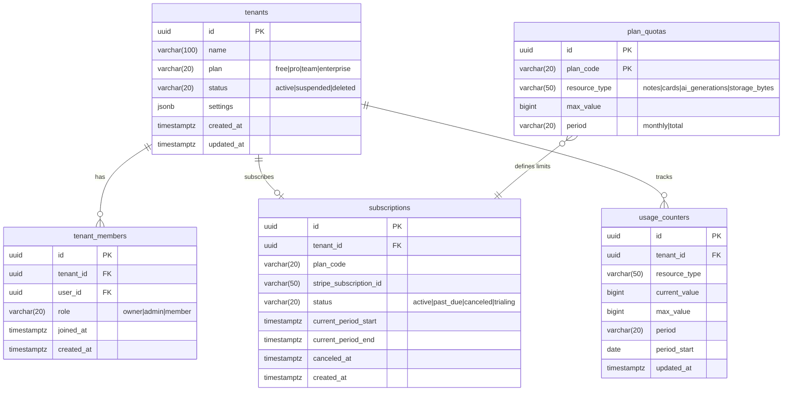
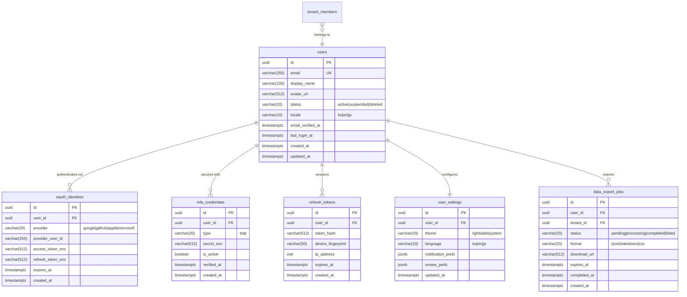
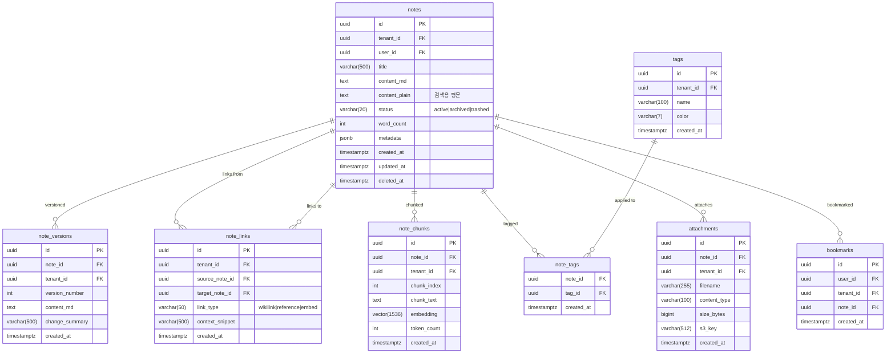
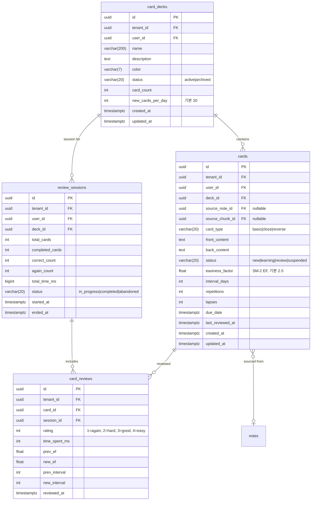
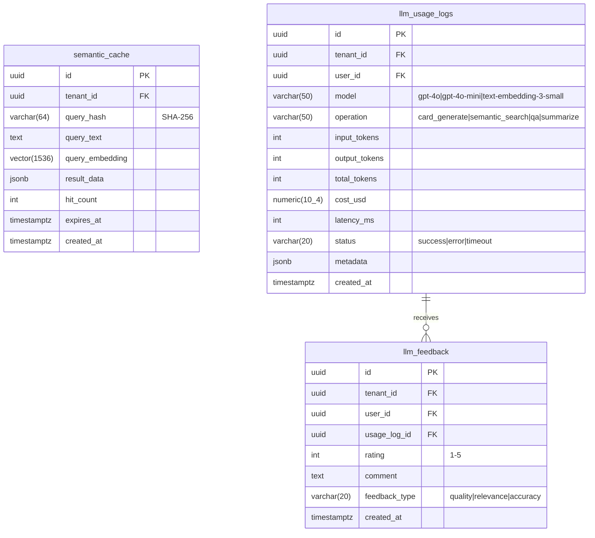
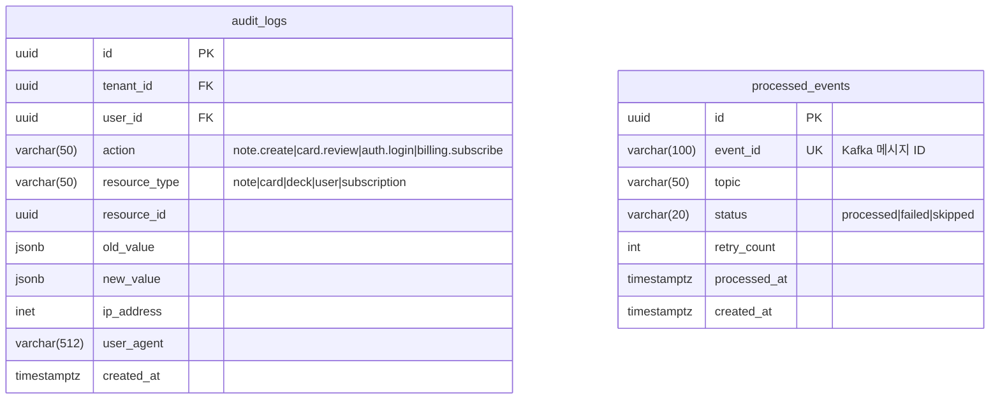

# 2. ERD 문서

> **프로젝트명**: Synapse — 통합 학습-지식 그래프 SaaS
> **버전**: v1.0
> **작성일**: 2026-05-07
> **기술 스택**: Spring Boot 4, Flutter 3.x, FastAPI, PostgreSQL 16, Redis, Elasticsearch, Kafka, K8s

---

## 2.1 데이터베이스 설계 원칙

### 멀티테넌시 전략

- **모델**: Pool (단일 DB, 공유 스키마)
- **격리**: Row Level Security (RLS) + 애플리케이션 레벨 tenant_id 강제 필터
- **인덱스 규칙**: 모든 인덱스는 `tenant_id`를 prefix로 포함

### 공통 컬럼 규약

| 컬럼 | 타입 | 설명 |
|------|------|------|
| id | UUID (v7) | PK, 시간 순서 보장 |
| tenant_id | UUID | FK → tenants.id, NOT NULL |
| created_at | TIMESTAMPTZ | 생성 시각, DEFAULT now() |
| updated_at | TIMESTAMPTZ | 수정 시각, 트리거 자동 갱신 |
| deleted_at | TIMESTAMPTZ | 소프트 삭제, NULL = 활성 |

---

## 2.2 ERD 다이어그램

### 2.2.1 테넌시/빌링 도메인



### 2.2.2 인증/사용자 도메인



### 2.2.3 노트 도메인



### 2.2.4 카드/SRS 도메인



### 2.2.5 AI/RAG 도메인



### 2.2.6 감사 도메인



---

## 2.3 인덱스 설계 규칙

### 네이밍 컨벤션

```
idx_{table}_{columns}
uq_{table}_{columns}
```

### 핵심 인덱스

| 테이블 | 인덱스 | 컬럼 | 타입 |
|--------|--------|------|------|
| notes | idx_notes_tenant_user | (tenant_id, user_id, deleted_at) | B-tree |
| notes | idx_notes_tenant_status | (tenant_id, status, updated_at DESC) | B-tree |
| note_links | idx_note_links_target | (tenant_id, target_note_id) | B-tree |
| note_chunks | idx_note_chunks_embedding | (embedding) | IVFFlat (lists=100) |
| cards | idx_cards_tenant_due | (tenant_id, user_id, status, due_date) | B-tree |
| cards | idx_cards_deck | (tenant_id, deck_id, status) | B-tree |
| card_reviews | idx_card_reviews_card | (tenant_id, card_id, reviewed_at DESC) | B-tree |
| audit_logs | idx_audit_tenant_time | (tenant_id, created_at DESC) | B-tree |
| semantic_cache | idx_semantic_cache_hash | (tenant_id, query_hash) | B-tree |
| semantic_cache | idx_semantic_cache_vec | (query_embedding) | HNSW (m=16, ef=64) |

### 파티셔닝 전략

```sql
-- audit_logs: 월별 파티셔닝
CREATE TABLE audit_logs (
    ...
) PARTITION BY RANGE (created_at);

CREATE TABLE audit_logs_2026_01 PARTITION OF audit_logs
    FOR VALUES FROM ('2026-01-01') TO ('2026-02-01');

-- card_reviews: 월별 파티셔닝
CREATE TABLE card_reviews (
    ...
) PARTITION BY RANGE (reviewed_at);
```

---

## 2.4 RLS 정책 예시

### 기본 RLS 정책

```sql
-- notes 테이블 RLS
ALTER TABLE notes ENABLE ROW LEVEL SECURITY;

CREATE POLICY notes_tenant_isolation ON notes
    USING (tenant_id = current_setting('app.current_tenant_id')::uuid);

CREATE POLICY notes_user_access ON notes
    FOR ALL
    USING (
        tenant_id = current_setting('app.current_tenant_id')::uuid
        AND (
            user_id = current_setting('app.current_user_id')::uuid
            OR current_setting('app.current_role') = 'admin'
        )
    );
```

### 테넌트 컨텍스트 설정

```sql
-- 요청마다 Gateway에서 설정
SET LOCAL app.current_tenant_id = 'tenant-uuid-here';
SET LOCAL app.current_user_id = 'user-uuid-here';
SET LOCAL app.current_role = 'member';
```

---

## 2.5 데이터 흐름 요약

```
노트 작성 → notes INSERT
         → note_versions INSERT (비동기)
         → note_links UPSERT (위키링크 파싱)
         → note_chunks INSERT (청킹 + 임베딩, 비동기)
         → Elasticsearch 인덱싱 (Kafka)

카드 생성 → cards INSERT
         → card_decks.card_count UPDATE

복습 제출 → card_reviews INSERT
         → cards UPDATE (SM-2 계산)
         → review_sessions UPDATE
         → usage_counters INCREMENT (Kafka)
```

---

## 2.6 마이그레이션 전략

- **도구**: Flyway 10.x
- **네이밍**: `V{version}__{description}.sql`
- **규칙**:
  - DDL과 DML 분리
  - 모든 마이그레이션 되돌리기 가능하도록 작성
  - 대용량 테이블 변경 시 `CREATE INDEX CONCURRENTLY` 사용
  - RLS 정책은 별도 마이그레이션 파일로 관리
