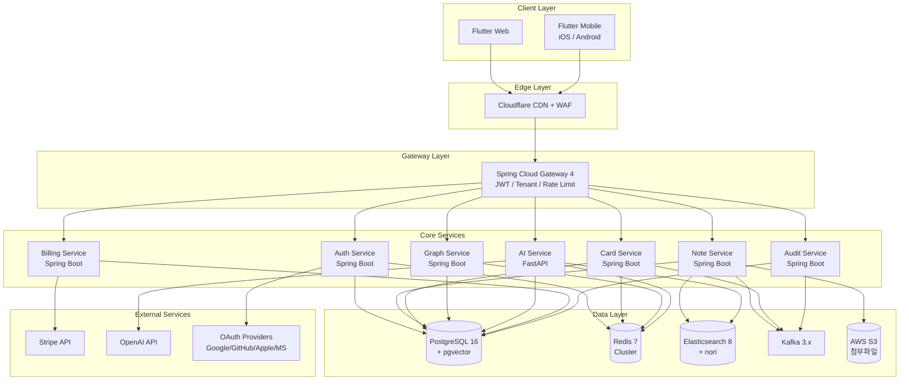
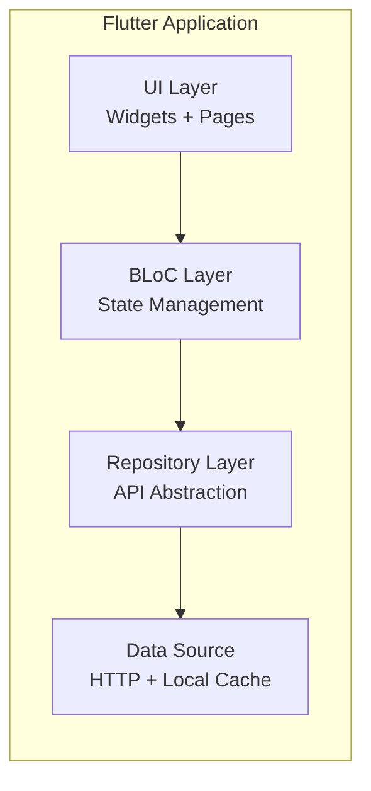
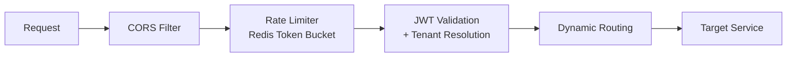
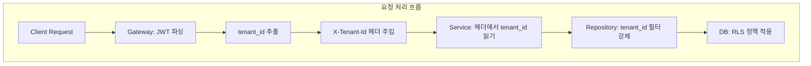
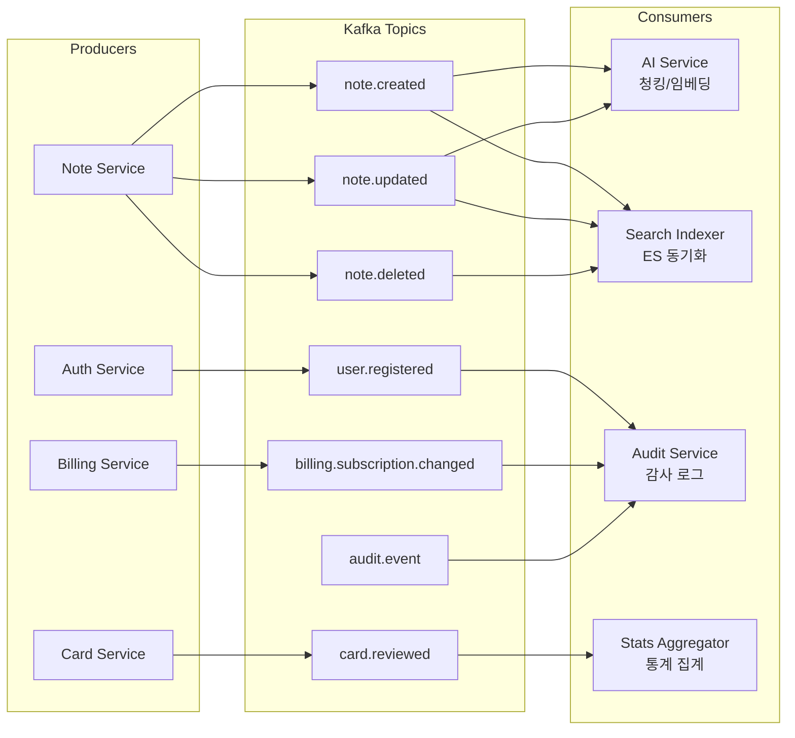
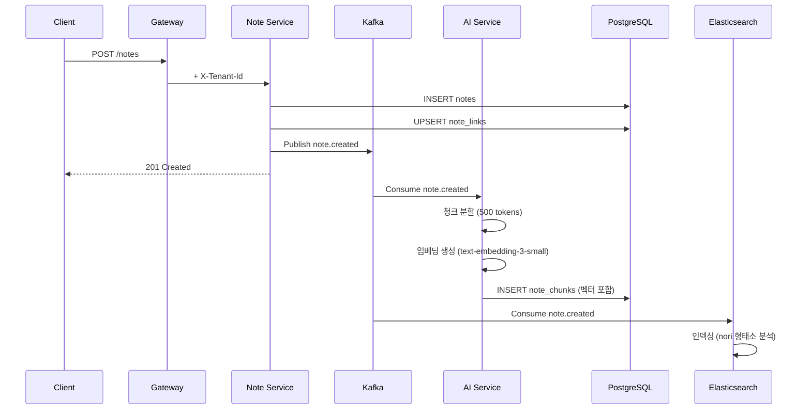
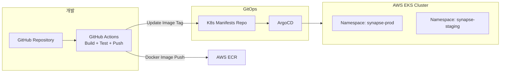

# 3. 프로젝트 아키텍처 정의서

> **프로젝트명**: Synapse — 통합 학습-지식 그래프 SaaS
> **버전**: v1.0
> **작성일**: 2026-05-07
> **기술 스택**: Spring Boot 4, Flutter 3.x, FastAPI, PostgreSQL 16, Redis, Elasticsearch, Kafka, K8s

---

## 3.1 시스템 아키텍처 개요

### 전체 아키텍처 다이어그램



---

## 3.2 레이어별 상세 설계

### 3.2.1 Edge Layer (Cloudflare)

| 기능 | 설명 |
|------|------|
| CDN | Flutter Web 정적 자산 캐싱 (HTML/JS/CSS/WASM) |
| WAF | OWASP 규칙, Rate Limiting (IP 기반) |
| DDoS | L3/L4/L7 DDoS 방어 |
| SSL | 전구간 TLS 1.3 |
| DNS | synapse.app 도메인 관리 |

### 3.2.2 Client Layer (Flutter 3.x)



| 플랫폼 | 빌드 | 배포 |
|---------|------|------|
| Web | Flutter Web (CanvasKit) | Cloudflare Pages |
| iOS | Flutter iOS | App Store |
| Android | Flutter Android | Google Play |

### 3.2.3 Gateway Layer (Spring Cloud Gateway 4)



**Gateway 필터 체인:**

1. **CORS Filter**: 허용 Origin 검증
2. **Rate Limiter**: Redis Token Bucket (플랜별 차등)
3. **JWT Validator**: Access Token 검증 + 클레임 추출
4. **Tenant Resolver**: JWT에서 tenant_id 추출 → X-Tenant-Id 헤더 주입
5. **Request Logger**: 요청 메타데이터 Kafka 발행
6. **Circuit Breaker**: Resilience4j 기반 서킷 브레이커

**Rate Limit 정책:**

| 플랜 | API 호출 | AI 호출 | Burst |
|------|----------|---------|-------|
| Free | 100/min | 10/day | 20 |
| Pro | 1000/min | 500/month | 100 |
| Team | 3000/min | 1000/month | 200 |

### 3.2.4 Core Services

#### Auth Service (Spring Boot 4)

| 책임 | 상세 |
|------|------|
| OAuth 2.0 | Google/GitHub/Apple/Microsoft 연동 |
| JWT 발급 | Access (15분) + Refresh (7일) httpOnly Cookie |
| MFA | TOTP 기반 2단계 인증 |
| 세션 관리 | Redis 기반 Refresh Token 관리 |
| 테넌트 생성 | 가입 시 자동 생성 + 초대 가입 |

#### Note Service (Spring Boot 4)

| 책임 | 상세 |
|------|------|
| 노트 CRUD | Markdown 저장/조회/수정/삭제 |
| 위키링크 파싱 | `[[링크]]` 구문 파싱 → note_links 갱신 |
| 버전 관리 | 저장 시 note_versions 생성 |
| 청킹/임베딩 | 비동기: 노트 → 청크 분할 → 벡터 생성 (Kafka) |
| 검색 인덱싱 | Elasticsearch 동기화 (Kafka) |
| 첨부파일 | S3 Presigned URL 발급 |

#### Card Service (Spring Boot 4)

| 책임 | 상세 |
|------|------|
| 카드/덱 CRUD | 수동 카드 생성/관리 |
| SRS 스케줄링 | SM-2 알고리즘 기반 due_date 계산 |
| 복습 큐 | 오늘의 복습 카드 조회 (due_date <= now) |
| 복습 제출 | rating → SM-2 계산 → 다음 복습일 갱신 |
| 세션 관리 | review_sessions 시작/완료/통계 |

#### Graph Service (Spring Boot 4)

| 책임 | 상세 |
|------|------|
| 백링크 조회 | 특정 노트를 가리키는 모든 노트 조회 |
| 그래프 데이터 | 노드(노트) + 엣지(링크) → D3.js 시각화 데이터 |
| PageRank | 주기적 PageRank 계산 → 중요 노트 식별 |
| 클러스터링 | 관련 노트 그룹 자동 감지 |

#### AI Service (FastAPI)

| 책임 | 상세 |
|------|------|
| 카드 자동 생성 | 노트 텍스트 → LLM → 카드 (basic/cloze) |
| 시맨틱 검색 | 쿼리 임베딩 → pgvector 유사도 검색 |
| 하이브리드 검색 | 시맨틱 + BM25 (Elasticsearch) RRF 결합 |
| Q&A | RAG 기반 지식 기반 질문 응답 |
| 시맨틱 캐시 | 유사 쿼리 캐시 (코사인 유사도 > 0.95) |
| 사용량 추적 | 토큰/비용 로깅 |

#### Billing Service (Spring Boot 4)

| 책임 | 상세 |
|------|------|
| 플랜 관리 | Free/Pro/Team/Enterprise 정의 |
| Stripe 연동 | Checkout Session / Customer Portal |
| Webhook 처리 | 결제 성공/실패/구독 변경 이벤트 |
| 사용량 제한 | usage_counters 확인 → 403 반환 |
| 인보이스 | Stripe Invoice 조회 |

#### Audit Service (Spring Boot 4)

| 책임 | 상세 |
|------|------|
| 감사 로그 수집 | Kafka 이벤트 소비 → audit_logs 적재 |
| 이벤트 중복 방지 | processed_events 기반 Idempotency |
| 로그 조회 | 관리자 감사 로그 검색 API |
| 보존 정책 | 90일 보존 → Cold Storage 이관 |

---

## 3.3 멀티테넌시 모델

### 아키텍처 결정



### 3단계 격리

| 레벨 | 구현 | 목적 |
|------|------|------|
| L1: Gateway | JWT → tenant_id 추출 + 헤더 주입 | 인증된 테넌트만 진입 |
| L2: Application | BaseRepository에서 tenant_id WHERE 강제 | 코드 레벨 격리 |
| L3: Database | PostgreSQL RLS 정책 | DB 레벨 최종 방어선 |

### Tenant Context Propagation

```java
// TenantContext (ThreadLocal)
@Component
public class TenantContextFilter implements WebFilter {
    @Override
    public Mono<Void> filter(ServerWebExchange exchange, WebFilterChain chain) {
        String tenantId = exchange.getRequest()
            .getHeaders().getFirst("X-Tenant-Id");
        TenantContext.set(tenantId);
        // SET LOCAL app.current_tenant_id = ?
        return chain.filter(exchange)
            .contextWrite(ctx -> ctx.put("tenantId", tenantId));
    }
}
```

---

## 3.4 이벤트 기반 통합 (Event-Driven)

### Kafka 토픽 설계



### 이벤트 스키마 (CloudEvents 호환)

```json
{
  "specversion": "1.0",
  "id": "evt-uuid-v7",
  "source": "synapse/note-service",
  "type": "note.created",
  "subject": "notes/{note-id}",
  "time": "2026-05-07T10:30:00Z",
  "tenantid": "tenant-uuid",
  "datacontenttype": "application/json",
  "data": {
    "noteId": "note-uuid",
    "userId": "user-uuid",
    "title": "노트 제목",
    "contentLength": 1500
  }
}
```

---

## 3.5 데이터 흐름 아키텍처

### 노트 작성 → 검색 가능까지



---

## 3.6 배포 아키텍처

### AWS EKS + ArgoCD GitOps



### K8s 리소스 구성

| 서비스 | Replicas | CPU | Memory | HPA |
|--------|----------|-----|--------|-----|
| Gateway | 2 | 500m | 512Mi | 2-5 (CPU 70%) |
| Auth Service | 2 | 250m | 512Mi | 2-4 |
| Note Service | 2 | 500m | 1Gi | 2-6 |
| Card Service | 2 | 250m | 512Mi | 2-4 |
| Graph Service | 1 | 500m | 1Gi | 1-3 |
| AI Service | 2 | 1000m | 2Gi | 2-8 |
| Billing Service | 1 | 250m | 512Mi | 1-2 |
| Audit Service | 1 | 250m | 512Mi | 1-2 |

---

## 3.7 보안 아키텍처

### 인증/인가 흐름

```
Client → Cloudflare (TLS 1.3)
       → Gateway (JWT 검증, tenant_id 추출)
       → Service (RBAC 확인)
       → DB (RLS 적용)
```

### 보안 설계 원칙

| 원칙 | 구현 |
|------|------|
| Zero Trust | 서비스 간 mTLS (Istio) |
| 최소 권한 | K8s RBAC + DB Role 분리 |
| 암호화 | 전구간 TLS + 민감 데이터 AES-256-GCM |
| 감사 | 모든 변경 audit_logs 기록 |
| 비밀 관리 | AWS Secrets Manager + External Secrets Operator |

---

## 3.8 모니터링 및 관측성

| 계층 | 도구 | 목적 |
|------|------|------|
| Metrics | Prometheus + Grafana | CPU/Memory/RPS/Latency |
| Logging | Fluent Bit → CloudWatch | 구조화 로그 수집 |
| Tracing | OpenTelemetry → Jaeger | 분산 추적 |
| Alerting | AlertManager → Slack | 이상 감지 알림 |
| APM | Sentry | 에러 추적 + 성능 모니터링 |
