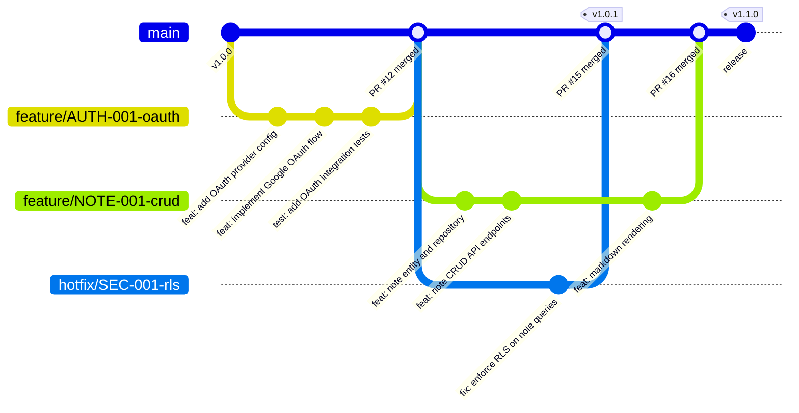

# 9. Git 규칙 정의서

> **프로젝트명**: Synapse — 통합 학습-지식 그래프 SaaS
> **버전**: v1.0
> **작성일**: 2026-05-07
> **기술 스택**: Spring Boot 4, Flutter 3.x, FastAPI, PostgreSQL 16, Redis, Elasticsearch, Kafka, K8s

---

## 1. 브랜치 전략 (GitHub Flow)

### 1.1 브랜치 구조

```
main (production-ready)
├── feature/AUTH-001-oauth-login
├── feature/NOTE-002-wikilink
├── fix/CARD-003-srs-calculation
├── hotfix/SEC-001-rls-bypass
├── docs/update-api-spec
└── chore/upgrade-spring-boot
```

### 1.2 브랜치 명명 규칙

| 접두사 | 용도 | 예시 |
|--------|------|------|
| `feature/` | 새로운 기능 개발 | `feature/AUTH-001-oauth-login` |
| `fix/` | 버그 수정 | `fix/SRS-003-interval-calc` |
| `hotfix/` | 프로덕션 긴급 수정 | `hotfix/SEC-001-rls-bypass` |
| `docs/` | 문서 작업 | `docs/api-swagger-update` |
| `chore/` | 설정/의존성 등 유지보수 | `chore/upgrade-elasticsearch-8` |
| `refactor/` | 코드 리팩토링 | `refactor/note-service-cleanup` |
| `test/` | 테스트 추가/수정 | `test/srs-algorithm-edge-cases` |

### 1.3 브랜치 규칙

- `main` 브랜치는 항상 배포 가능한 상태 유지
- 모든 작업은 `main`에서 분기하여 PR로 병합
- 브랜치 수명: 최대 5일 (초과 시 분할 권장)
- 머지 후 원격 브랜치 자동 삭제
- Force push 금지 (main 브랜치 보호 규칙 적용)

### 1.4 Mermaid Git Graph



---

## 2. 커밋 메시지 (Conventional Commits)

### 2.1 형식

```
<type>(<scope>): <subject>

[body]

[footer]
```

### 2.2 Type 정의

| Type | 설명 | SemVer 영향 |
|------|------|-------------|
| `feat` | 새로운 기능 추가 | MINOR |
| `fix` | 버그 수정 | PATCH |
| `docs` | 문서 수정 | - |
| `style` | 코드 포맷팅 (로직 변경 없음) | - |
| `refactor` | 리팩토링 (기능/버그 아님) | - |
| `test` | 테스트 추가/수정 | - |
| `chore` | 빌드/설정/의존성 변경 | - |
| `perf` | 성능 개선 | PATCH |
| `ci` | CI/CD 설정 변경 | - |
| `revert` | 이전 커밋 되돌리기 | - |

### 2.3 Scope 정의

| Scope | 대상 도메인 |
|-------|-------------|
| `auth` | 인증/인가 |
| `note` | 노트 관리 |
| `card` | 카드/덱 관리 |
| `srs` | 간격반복 알고리즘 |
| `graph` | 지식 그래프 |
| `ai` | AI/RAG 서비스 |
| `billing` | 결제/구독 |
| `infra` | 인프라/배포 |
| `ui` | 프론트엔드 UI |
| `api` | API Gateway |

### 2.4 커밋 메시지 예시

```
feat(note): add wikilink auto-completion

- Implement [[...]] syntax detection in editor
- Add debounced search for existing note titles
- Show dropdown with matching notes

Closes #42
```

```
fix(srs): correct SM-2 ease factor calculation

EaseFactor was not clamped to minimum 1.3 when
quality < 3, causing intervals to shrink indefinitely.

Fixes #78
```

```
feat(auth)!: migrate to OAuth 2.1 with PKCE

BREAKING CHANGE: Legacy OAuth 2.0 implicit flow
tokens are no longer accepted. All clients must
use authorization code flow with PKCE.
```

### 2.5 커밋 규칙

- 제목(subject): 50자 이내, 영문 소문자 시작, 마침표 없음
- 본문(body): 72자 줄바꿈, "무엇"보다 "왜" 설명
- Breaking Change: `!` 접미사 + footer에 `BREAKING CHANGE:` 명시
- Issue 연결: `Closes #N`, `Fixes #N`, `Refs #N`
- 하나의 커밋 = 하나의 논리적 변경

---

## 3. Pull Request (PR) 규칙

### 3.1 PR 제목 형식

```
<type>(<scope>): <간결한 설명> (#이슈번호)
```

예시: `feat(note): implement wikilink navigation (#42)`

### 3.2 PR 본문 템플릿

```markdown
## 변경 사항
<!-- 이 PR에서 변경한 내용을 요약합니다 -->

-
-

## 변경 유형
- [ ] 새 기능 (feat)
- [ ] 버그 수정 (fix)
- [ ] 리팩토링 (refactor)
- [ ] 문서 (docs)
- [ ] 테스트 (test)
- [ ] 기타 (chore)

## 관련 이슈
<!-- Closes #이슈번호 -->

## 테스트 방법
<!-- 리뷰어가 변경사항을 검증할 수 있는 방법 -->

1.
2.
3.

## 스크린샷 (UI 변경 시)
<!-- Before/After 스크린샷 첨부 -->

## 체크리스트
- [ ] 코드 셀프 리뷰 완료
- [ ] 테스트 추가/수정 완료
- [ ] 문서 업데이트 (필요 시)
- [ ] 멀티테넌트 격리 확인 (DB 쿼리 변경 시)
- [ ] Breaking change 여부 확인
```

### 3.3 PR 규칙

| 항목 | 규칙 |
|------|------|
| 최소 승인 | 1명 이상 Approve (Maintainer 또는 지정 Reviewer) |
| CI 통과 | 모든 CI 파이프라인 성공 필수 |
| 충돌 해결 | 머지 전 충돌 없음 확인 |
| 크기 제한 | 변경 파일 400줄 이하 권장 (초과 시 분할) |
| 리뷰 응답 | 24시간 이내 첫 리뷰 |
| 머지 방식 | Squash and Merge (feature), Merge Commit (hotfix) |
| 라벨 | `size/S`, `size/M`, `size/L`, `priority/high` 등 |

### 3.4 자동화 (GitHub Actions)

PR 생성 시 자동 실행:
- Lint (ESLint, ktlint, dartanalyzer)
- 단위 테스트
- 통합 테스트 (Testcontainers)
- 빌드 검증
- 코드 커버리지 리포트
- SonarQube 분석
- Snyk 보안 스캔

---

## 4. 릴리즈 및 태깅 (Semantic Versioning)

### 4.1 버전 형식

```
v{MAJOR}.{MINOR}.{PATCH}[-{pre-release}]
```

| 구분 | 변경 시점 | 예시 |
|------|-----------|------|
| MAJOR | 호환되지 않는 API 변경 | v2.0.0 |
| MINOR | 하위 호환 기능 추가 | v1.1.0 |
| PATCH | 하위 호환 버그 수정 | v1.0.1 |
| Pre-release | 사전 릴리즈 | v1.1.0-beta.1 |

### 4.2 릴리즈 프로세스

```
1. main 브랜치에서 릴리즈 준비
2. CHANGELOG.md 업데이트
3. 버전 태그 생성: git tag -a v1.1.0 -m "Release v1.1.0"
4. GitHub Release 생성 (자동: GitHub Actions)
5. Docker 이미지 빌드 + 태깅
6. ArgoCD 자동 배포 트리거
```

### 4.3 CHANGELOG 형식

```markdown
## [1.1.0] - 2026-06-15

### Added
- 위키링크 자동완성 기능 (#42)
- AI 카드 생성 스트리밍 응답 (#55)

### Fixed
- SM-2 EaseFactor 최솟값 미적용 버그 (#78)

### Changed
- 검색 API 응답 구조 변경 (#61)
```

---

## 5. 기타 규칙

### 5.1 .gitignore 필수 항목

```
# IDE
.idea/
.vscode/
*.iml

# Build
build/
target/
.dart_tool/

# Environment
.env
.env.local
*.key
*.pem

# OS
.DS_Store
Thumbs.db

# Dependencies
node_modules/
.pub-cache/
```

### 5.2 Git Hooks (Husky / pre-commit)

| Hook | 동작 |
|------|------|
| `pre-commit` | lint-staged 실행 (포맷팅 + 린트) |
| `commit-msg` | Conventional Commits 형식 검증 |
| `pre-push` | 단위 테스트 실행 |

### 5.3 코드 소유권 (CODEOWNERS)

```
# Global
* @synapse-team

# Backend
/backend/ @synapse-team
/backend/auth-service/ @synapse-team

# Frontend
/frontend/ @synapse-team

# AI Service
/ai-service/ @synapse-team

# Infrastructure
/infra/ @synapse-team
```

---

## 6. 변경 이력

| 버전 | 날짜 | 작성자 | 변경 내용 |
|------|------|--------|-----------|
| v1.0 | 2026-05-07 | Synapse Team | 초안 작성 |
