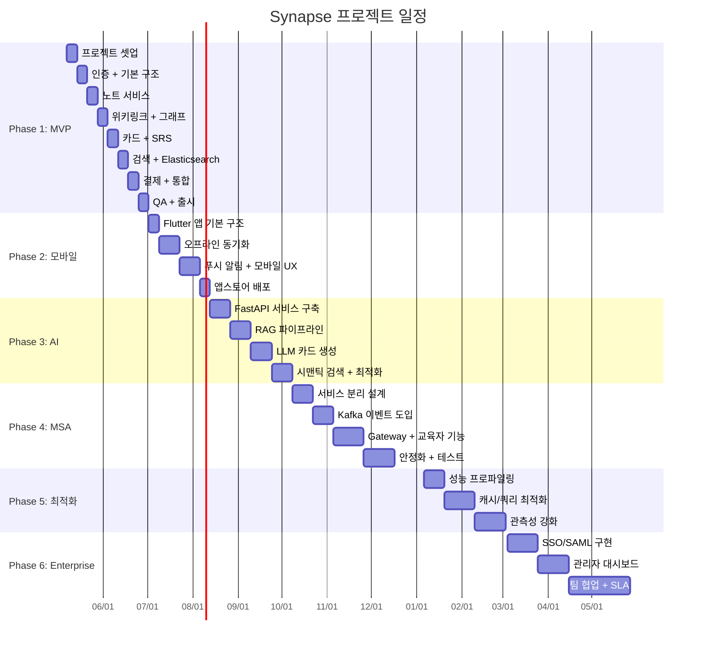

# 17. 스케줄

> **프로젝트명**: Synapse — 통합 학습-지식 그래프 SaaS
> **버전**: v1.0
> **작성일**: 2026-05-07
> **기술 스택**: Spring Boot 4, Flutter 3.x, FastAPI, PostgreSQL 16, Redis, Elasticsearch, Kafka, K8s

---

## 1. 프로젝트 로드맵

### 전체 일정 (약 12개월)

```
2026
 5월      6월      7월      8월      9월     10월     11월     12월
├────────┼────────┼────────┼────────┼────────┼────────┼────────┼────────┤
│ ████████████████ │        │        │        │        │        │        │
│  Phase 1: MVP    │        │        │        │        │        │        │
│  (8주)           │        │        │        │        │        │        │
│                  │████████████     │        │        │        │        │
│                  │ Phase 2: 모바일  │        │        │        │        │
│                  │ (6주)           │        │        │        │        │
│                  │        │████████████████ │        │        │        │
│                  │        │ Phase 3: AI     │        │        │        │
│                  │        │ (8주)           │        │        │        │
│                  │        │        │        │██████████████████████     │
│                  │        │        │        │ Phase 4: MSA (10주)       │
├────────┼────────┼────────┼────────┼────────┼────────┼────────┼────────┤

2027
 1월      2월      3월      4월      5월+
├────────┼────────┼────────┼────────┼────────
│████████████████ │        │        │
│ Phase 5: 최적화  │        │        │
│ (8주)           │        │        │
│                  │████████████████████████████...
│                  │ Phase 6: Enterprise (12주+)
├────────┼────────┼────────┼────────┼────────
```

---

## 2. 마일스톤 상세

### M1: Phase 1 — MVP (8주)

| 항목 | 내용 |
|------|------|
| **기간** | 2026-05-07 ~ 2026-07-01 |
| **목표** | 핵심 기능 동작하는 웹 MVP 출시 |
| **핵심 산출물** | 노트 CRUD, 위키링크, 기본 SRS, 검색, 인증, Free/Pro 결제 |

**성공 기준**:
- [ ] 사용자가 노트를 생성하고 위키링크로 연결할 수 있다
- [ ] 기본 SRS 카드 생성 및 복습 세션이 동작한다
- [ ] 한국어 전문 검색이 정상 동작한다 (P95 < 200ms)
- [ ] 회원가입/로그인/JWT 인증 정상 동작
- [ ] Stripe 연동 Free/Pro 결제 동작
- [ ] 테스트 커버리지 80% 이상
- [ ] Staging 환경 배포 완료

### M2: Phase 2 — 모바일 (6주)

| 항목 | 내용 |
|------|------|
| **기간** | 2026-07-02 ~ 2026-08-12 |
| **목표** | Flutter 모바일 앱 (iOS/Android) 출시 |
| **핵심 산출물** | 모바일 앱, 오프라인 동기화, 푸시 알림 |

**성공 기준**:
- [ ] iOS App Store / Google Play 배포 완료
- [ ] 오프라인 노트 작성 및 동기화 정상 동작
- [ ] 복습 푸시 알림 정상 발송
- [ ] 모바일 전용 E2E 테스트 통과
- [ ] 앱 크래시율 < 0.5%
- [ ] Cold Start < 3초

### M3: Phase 3 — AI (8주)

| 항목 | 내용 |
|------|------|
| **기간** | 2026-08-13 ~ 2026-10-07 |
| **목표** | AI 기반 카드 자동 생성 + 시맨틱 검색 |
| **핵심 산출물** | FastAPI AI Service, RAG 파이프라인, LLM 카드 생성, 벡터 검색 |

**성공 기준**:
- [ ] 노트에서 AI 카드 자동 생성 (품질 4.0/5.0 이상)
- [ ] 시맨틱 검색 동작 (pgvector + Embedding)
- [ ] LLM 호출 비용 일 $50 이내
- [ ] AI 서비스 P95 < 5초
- [ ] LangSmith 모니터링 구축 완료
- [ ] Rate Limiting 적용 (사용자별 일일 한도)

### M4: Phase 4 — MSA 전환 (10주)

| 항목 | 내용 |
|------|------|
| **기간** | 2026-10-08 ~ 2026-12-16 |
| **목표** | 모놀리스 → 마이크로서비스 전환, 교육자 역할 추가 |
| **핵심 산출물** | 서비스 분리, Kafka 이벤트, API Gateway, 교육자 기능 |

**성공 기준**:
- [ ] 5개 서비스 독립 배포 가능
- [ ] Kafka 이벤트 기반 비동기 통신 구현
- [ ] Spring Cloud Gateway 라우팅 정상 동작
- [ ] 교육자 역할 (덱 공유, 학습자 통계) 동작
- [ ] 서비스 간 장애 전파 차단 (Circuit Breaker)
- [ ] 전체 시스템 P95 < 300ms 유지

### M5: Phase 5 — 최적화 (8주)

| 항목 | 내용 |
|------|------|
| **기간** | 2027-01-06 ~ 2027-03-03 |
| **목표** | 성능 최적화, 관측성 강화, SLA 달성 |
| **핵심 산출물** | 캐시 최적화, 쿼리 튜닝, 풀 관측성 스택, SLA 대시보드 |

**성공 기준**:
- [ ] API P95 < 150ms
- [ ] 월 Uptime 99.9% 달성
- [ ] Redis 캐시 히트율 > 90%
- [ ] DB 쿼리 슬로우 쿼리 0건 (1초 기준)
- [ ] 전체 관측성 스택 (Metrics/Logs/Traces) 통합 완료
- [ ] 비용 최적화 20% 절감

### M6: Phase 6 — Enterprise (12주+)

| 항목 | 내용 |
|------|------|
| **기간** | 2027-03-04 ~ 2027-05-26+ |
| **목표** | 기업용 기능, Team/Enterprise 플랜 출시 |
| **핵심 산출물** | SSO/SAML, 관리자 대시보드, 팀 협업, SLA 보증, 감사 로그 |

**성공 기준**:
- [ ] SAML/OIDC SSO 연동
- [ ] 관리자 대시보드 (사용자 관리, 통계, 감사 로그)
- [ ] Team 플랜 협업 기능 (공유 덱, 팀 그래프)
- [ ] Enterprise SLA 99.95% 보증
- [ ] SOC 2 준비 (감사 로그, 접근 제어)
- [ ] 첫 Enterprise 고객 계약

---

## 3. Phase 1 주간 체크리스트

### Week 1 (05/07 ~ 05/13): 프로젝트 셋업

- [ ] 개발 환경 구성 (Docker Compose, IDE 설정)
- [ ] Spring Boot 4 프로젝트 초기화 (Gradle, 의존성)
- [ ] PostgreSQL 16 스키마 설계 (ERD 확정)
- [ ] Flutter 프로젝트 초기화 (폴더 구조, 상태관리)
- [ ] GitHub 저장소 + CI 파이프라인 기본 구성
- [ ] API 명세 초안 작성 (OpenAPI 3.1)

### Week 2 (05/14 ~ 05/20): 인증 + 기본 구조

- [ ] 인증 서비스 구현 (회원가입, 로그인, JWT)
- [ ] RLS 정책 설정 (tenant_id 기반)
- [ ] API Gateway 기본 라우팅 구현
- [ ] Flutter 인증 화면 (로그인/가입)
- [ ] 단위 테스트 작성 (auth-service)
- [ ] CI에 테스트 자동화 추가

### Week 3 (05/21 ~ 05/27): 노트 서비스

- [ ] 노트 CRUD API 구현
- [ ] 마크다운 에디터 통합 (Flutter)
- [ ] 위키링크 파싱 및 저장 로직
- [ ] 노트 목록/검색 기본 UI
- [ ] 통합 테스트 작성 (Testcontainers)
- [ ] 코드 리뷰 + 리팩토링

### Week 4 (05/28 ~ 06/03): 위키링크 + 그래프

- [ ] 위키링크 자동완성 (검색 API 연동)
- [ ] 백링크 조회 API 구현
- [ ] 기본 그래프 뷰 (D3.js / Flutter Canvas)
- [ ] 그래프 데이터 모델링 (인접 리스트)
- [ ] 위키링크 E2E 테스트
- [ ] 성능 기준 측정 (베이스라인)

### Week 5 (06/04 ~ 06/10): 카드 + SRS

- [ ] 카드 CRUD API 구현
- [ ] SM-2 알고리즘 구현
- [ ] 복습 세션 UI (Flutter)
- [ ] 복습 일정 계산 로직
- [ ] 카드 생성 UI (수동)
- [ ] SRS 알고리즘 단위 테스트

### Week 6 (06/11 ~ 06/17): 검색 + Elasticsearch

- [ ] Elasticsearch 8 + nori 분석기 설정
- [ ] 노트/카드 인덱싱 파이프라인
- [ ] 검색 API 구현 (전문 검색)
- [ ] 검색 UI (Flutter)
- [ ] 검색 성능 테스트 (P95 < 200ms)
- [ ] 한국어 형태소 분석 정확도 검증

### Week 7 (06/18 ~ 06/24): 결제 + 통합

- [ ] Stripe 연동 (Checkout Session, Webhook)
- [ ] Free/Pro 플랜 분기 로직
- [ ] 결제 UI (Flutter)
- [ ] 멱등성 키 적용 (중복 결제 방지)
- [ ] 전체 기능 통합 테스트
- [ ] Staging 환경 배포

### Week 8 (06/25 ~ 07/01): QA + 출시

- [ ] 전체 E2E 테스트 실행
- [ ] 성능 테스트 (동시 100 사용자)
- [ ] 보안 점검 (OWASP Top 10)
- [ ] 버그 수정 + 안정화
- [ ] Production 배포
- [ ] 출시 모니터링 (48시간)

---

## 4. Gantt 차트



---

## 5. 주요 의존성 및 리스크

### 의존성 매트릭스

| Phase | 선행 조건 | 외부 의존성 |
|-------|-----------|-------------|
| Phase 1 | 없음 | Stripe API 계정, AWS 인프라 |
| Phase 2 | Phase 1 완료 | Apple Developer, Google Play Console |
| Phase 3 | Phase 1 완료 | OpenAI API, pgvector 확장 |
| Phase 4 | Phase 1-3 완료 | Kafka 클러스터 구축 |
| Phase 5 | Phase 4 완료 | 부하 테스트 도구 |
| Phase 6 | Phase 5 완료 | Enterprise 파일럿 고객 |

### 일정 리스크

| 리스크 | 영향 | 확률 | 완화 방안 |
|--------|------|------|-----------|
| 1인 개발 병목 | 전체 일정 지연 | 높음 | 외주 활용 (UI/인프라), MVP 범위 축소 |
| OpenAI API 정책 변경 | Phase 3 지연 | 중간 | 멀티 LLM 전략 (Claude, Gemini 백업) |
| 앱스토어 심사 지연 | Phase 2 지연 | 중간 | 사전 심사 가이드라인 준수, 여유 일정 |
| 성능 목표 미달 | Phase 5 연장 | 낮음 | 조기 성능 측정, 아키텍처 리뷰 |
| Enterprise 고객 요구사항 변동 | Phase 6 연장 | 높음 | 파일럿 고객 조기 확보, MVP 접근 |

---

## 6. 버퍼 및 조정 전략

### 버퍼 정책

- 각 Phase에 **10% 버퍼** 내장 (위 일정에 포함됨)
- Phase 간 **3일 전환 기간** (회고 + 다음 Phase 준비)
- 긴급 버그 수정용 **주 1일** 여유 확보

### 일정 조정 트리거

| 상황 | 조치 |
|------|------|
| 1주 이상 지연 | 범위 축소 검토 (Must/Should/Could 분류) |
| 2주 이상 지연 | Phase 합병 또는 기능 삭제 |
| 외주 투입 필요 | UI 컴포넌트, 인프라 셋업 우선 위임 |
| 기술 난이도 예상 초과 | 대안 기술 검토 또는 외부 라이브러리 활용 |

---

## 7. 완료 정의 (Definition of Done)

모든 마일스톤에 공통으로 적용되는 완료 기준:

1. **기능**: 성공 기준 체크리스트 100% 충족
2. **테스트**: 커버리지 80% 이상, E2E 시나리오 통과
3. **성능**: SLA 목표 달성 (P95 기준)
4. **보안**: OWASP Top 10 취약점 없음
5. **배포**: Staging 검증 완료 → Production 배포 완료
6. **문서**: API 명세 + 변경 로그 업데이트
7. **모니터링**: 대시보드 + 알림 설정 완료
